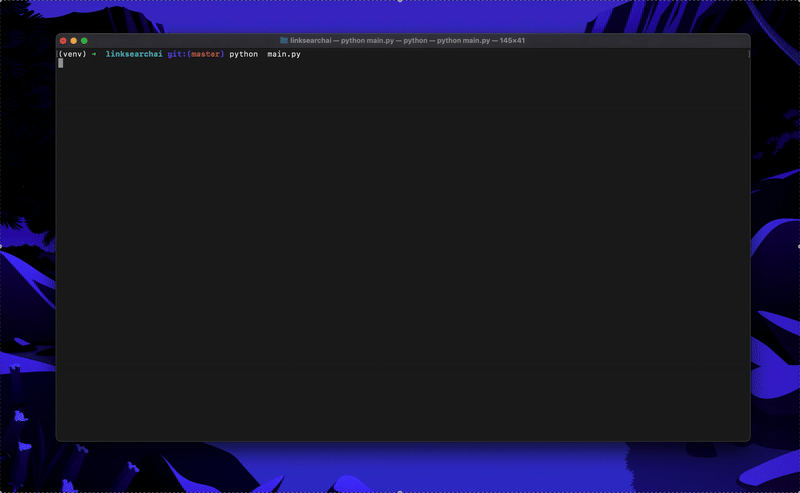

## Link Search AI

### Overview

Link Search AI is a project that leverages advanced natural language processing (NLP) models to extract relevant information from web pages and generate meaningful questions based on the extracted content. This project integrates two powerful models:

- **RoBERTa-base** fine-tuned with the SQuAD2.0 dataset. It is trained on question-answer pairs, including unanswerable questions, for extractive question-answering tasks.
- **T5-small** fine-tuned for end-to-end question generation. This model takes raw text input and generates multiple relevant questions.

### Installation

1. **Clone the repository:**

   Open your terminal or command prompt and run:

   ```bash
   git clone <repository-link>
   cd link-search-ai
   pip install -r requirements.txt
   ```

2. **Run the application:**

   ```bash
   python main.py
   ```

### Features

- Extracts key sections from a given webpage URL.
- Generates relevant questions based on the extracted content.
- Supports both extractive and generative question-answering models.

### Preview



### Usage

1. Enter a webpage URL.
2. Select a section from the extracted content.
3. The system will generate relevant questions based on the selected section.
4. View the extracted answers and questions.

### License

This project is open-source and available under the MIT License.

